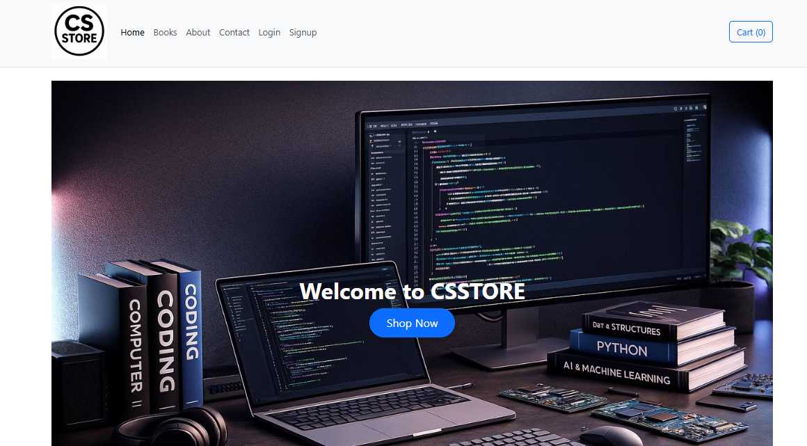
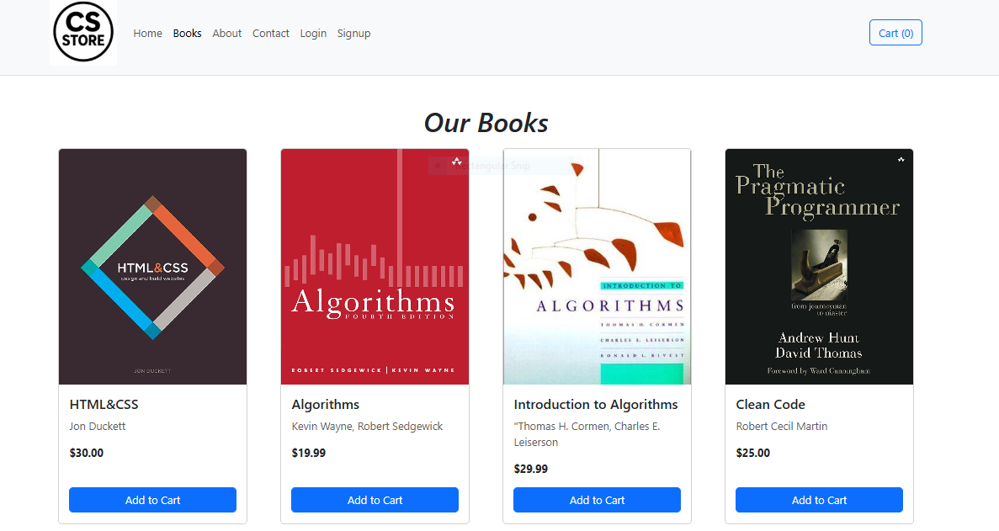
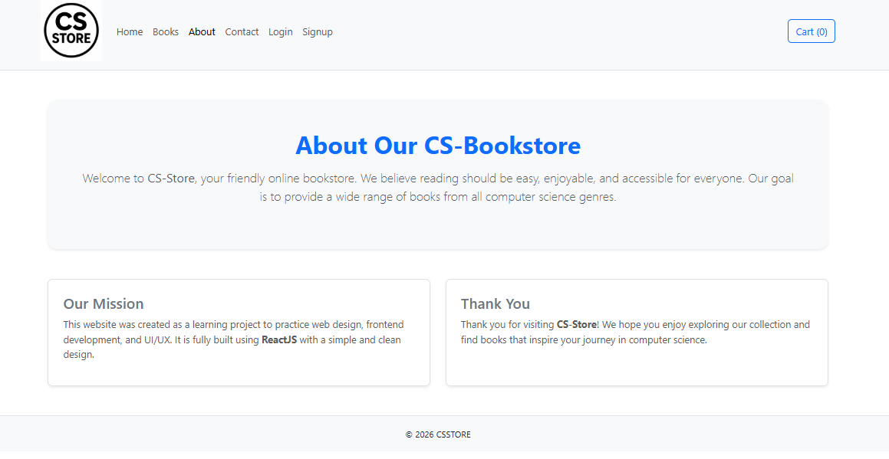
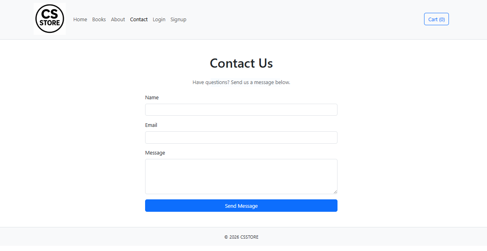
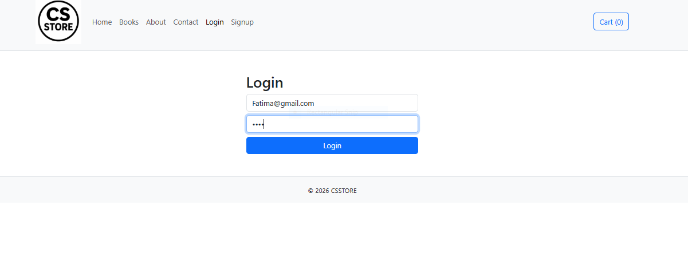
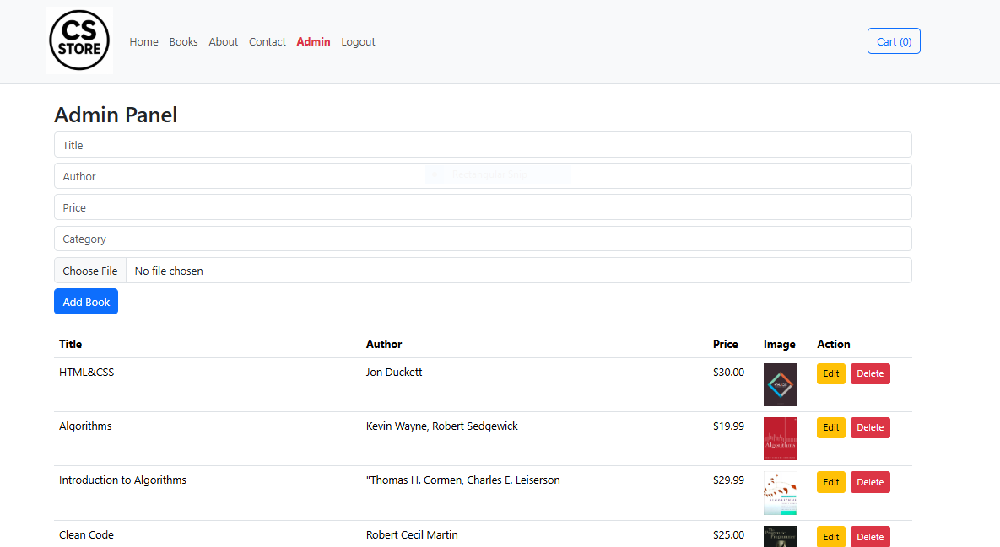
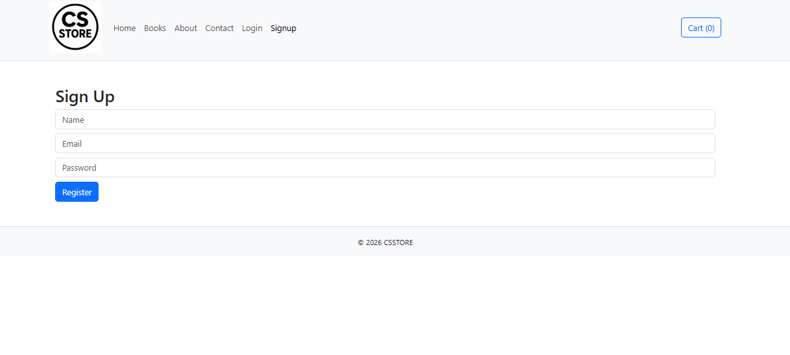
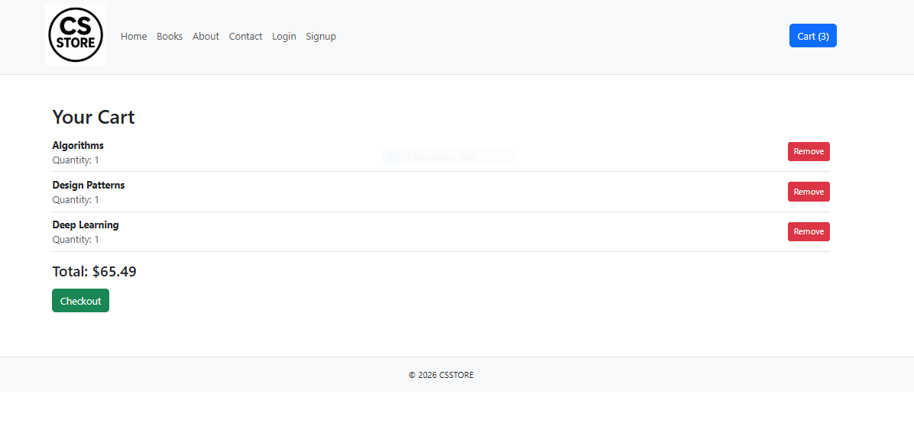

### Description : Phase2 : was done by completing the website with backend (Login,signup,Admin) and updating frontend.we create login page that only the admins can apply it , when the login is successful: Admin page appear so the admin can Add,edit and delete books. signup page is also created to add gmails that can apply login 

### Home Page

### Books Page

### About page

### Conact page

### Login page

### Admin page

### Signup page

### Cart page

